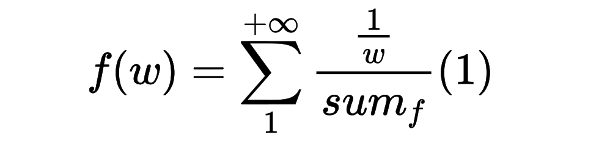
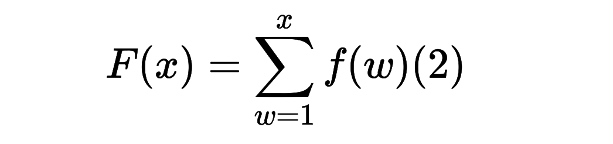

## 逆变换采样实现伪随机数


### 重量w的概率函数


已知重量`w`的权重为 `1/w`，则重量w的概率为：


```latex
sum_{f}=\sum_{t=1}^{+\infty} 1/t
```

`sumf`表示权重的总和，`t`表示重量，很显然，随着t增加，这是一个无限单增的离散函数。题目限制了最大重量为100KG





```latex
{f(w)} = \sum_{1}^{+\infty}  \frac{\frac{1}{w}}{sum_{f}}  \left (  1\right ) 
```

`f(w)`表示重量w随机出现的概率。


### 重量w的累积分布函数


重量w的累积分布函数，其实就是上边(1)式的前缀和。



```la
F(x)=\sum_{w=1}^{x}f(w) (2)
```


当 `x -> +Inf` 时，F(x) 趋近于 1。题目限制最大重量为`100KG`，所以有`F(100) = 1`

因此我们可以随机一个概率在 (0,1]之间，从而反推出落在这个概率区间中`x`的值，即为随机生成的重量。

有几个需要注意的地方：

-   想要通过这种方式随机生成重量w，上边(2)式的反函数也需要是一个函数，即对每一个因变量y，应当只有一个自变量x与其对应，然而对于`[0,1]`之间的概率，是浮点数，不便计算与查找。因此在计算时，**通过一个 scale_factor 参数，将概率映射到了整数空间**中。

-   我们可以通过计算`f(w)`前缀和的方式，计算出精度范围内的所有`w`的累加和`F(w)`，然后通过二分查找的方式，从这些累加和中超出对应随机生成的概率对应的`w`，即为我们所想要的随机生成的随机重量。

-   这个随机重量是整数值，我们还需要将这些值，减去一个`[0, 0.99]`的随机值，表示直接的重量。

-   仅限于当最大重量为100kg时适用